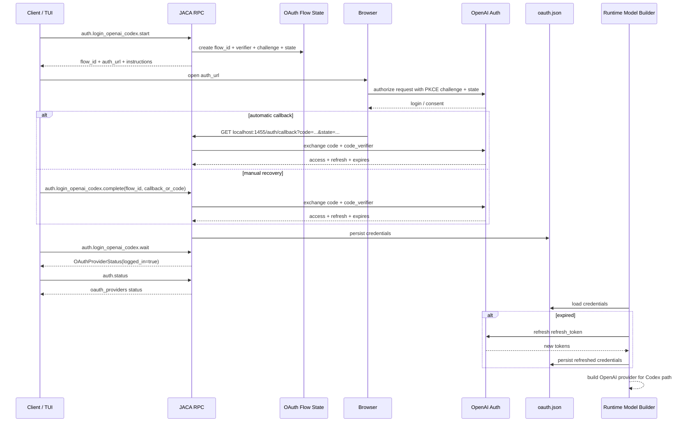

# OAuth Authentication Flow

read_when: you want a concise, visual map of JACA's OpenAI Codex OAuth flow, including PKCE, callback handling, storage, status, refresh, and runtime use

## Purpose

This is the current OAuth flow in JACA for:

- `openai-codex`

Read this with:

- [05-identity-api-and-observability.md](05-identity-api-and-observability.md)
- [../chatgpt-subscription-oauth-spike.md](../chatgpt-subscription-oauth-spike.md)

Core code anchors:

- [../../src/just_another_coding_agent/auth.py](../../src/just_another_coding_agent/auth.py)
- [../../src/just_another_coding_agent/oauth_openai_codex.py](../../src/just_another_coding_agent/oauth_openai_codex.py)
- [../../src/just_another_coding_agent/oauth_store.py](../../src/just_another_coding_agent/oauth_store.py)
- [../../src/just_another_coding_agent/rpc/stdio.py](../../src/just_another_coding_agent/rpc/stdio.py)
- [../../src/just_another_coding_agent/runtime/models.py](../../src/just_another_coding_agent/runtime/models.py)

## Main Flow



## The Three RPC Commands

- `auth.login_openai_codex.start`
  - starts the flow
  - returns `flow_id`, `auth_url`, and instructions

- `auth.login_openai_codex.wait`
  - canonical completion path
  - waits for the browser callback result already being tracked by the backend

- `auth.login_openai_codex.complete`
  - manual recovery path
  - user pastes callback URL or raw code if automatic callback does not finish

Contract refs:

- [../../src/just_another_coding_agent/contracts/rpc.py](../../src/just_another_coding_agent/contracts/rpc.py:139)
- [../contracts.md](../contracts.md:102)

## What The Backend Owns

The backend owns the flow state, not the client.

That means JACA stores:

- `flow_id`
- PKCE verifier
- OAuth `state`
- background wait task

The stdio RPC layer coordinates this in:

- [../../src/just_another_coding_agent/rpc/stdio.py](../../src/just_another_coding_agent/rpc/stdio.py:709)

This is a good design choice because the browser path and manual path both resolve the same canonical login result.

## PKCE In Plain English

PKCE is how JACA binds the returned authorization code to the same client that started the login flow.

```text
start:
  JACA creates a secret verifier
  JACA sends only the derived challenge in the browser request

finish:
  JACA sends the original verifier when exchanging the returned code
  OpenAI checks that verifier against the earlier challenge
```

Important values:

- `verifier`
  - secret random string
- `challenge`
  - SHA-256 / base64url form of the verifier
- `state`
  - separate anti-CSRF token
  - not the same thing as PKCE

Code refs:

- PKCE creation: [../../src/just_another_coding_agent/oauth_openai_codex.py](../../src/just_another_coding_agent/oauth_openai_codex.py:274)
- token exchange with `code_verifier`: [../../src/just_another_coding_agent/oauth_openai_codex.py](../../src/just_another_coding_agent/oauth_openai_codex.py:304)

## Callback Path

Automatic callback details:

- host: `localhost`
- port: `1455`
- path: `/auth/callback`

The callback handler:

- checks method and path
- validates `state`
- extracts `code`
- exchanges code for tokens

Code ref:

- [../../src/just_another_coding_agent/oauth_openai_codex.py](../../src/just_another_coding_agent/oauth_openai_codex.py:136)

## Stored State

OAuth credentials are stored in:

- `~/.jaca/oauth.json`

Stored shape:

- access token
- refresh token
- expires timestamp
- account id

Store ref:

- [../../src/just_another_coding_agent/oauth_store.py](../../src/just_another_coding_agent/oauth_store.py)

The write path is careful:

- write temp file
- chmod `0600`
- atomic replace

## Auth Status

The backend reports OAuth login state through:

- `OAuthProviderStatus`
- `auth.status`

That means clients do not infer login state locally.

Refs:

- [../../src/just_another_coding_agent/contracts/auth.py](../../src/just_another_coding_agent/contracts/auth.py)
- [../../src/just_another_coding_agent/auth.py](../../src/just_another_coding_agent/auth.py:127)

## Runtime Use And Refresh

When JACA later needs the OAuth-backed provider:

1. resolve credentials from env or `oauth.json`
2. if expired, refresh with the refresh token
3. persist refreshed credentials unless env credentials were injected
4. build the OpenAI provider for the Codex path

Refs:

- credential resolution: [../../src/just_another_coding_agent/auth.py](../../src/just_another_coding_agent/auth.py:197)
- runtime model/provider build: [../../src/just_another_coding_agent/runtime/models.py](../../src/just_another_coding_agent/runtime/models.py:127)

## What This Flow Is

- backend-owned auth lifecycle
- provider-specific OAuth implementation
- durable refreshable credential store
- contract-visible auth status
- runtime credential resolution before model construction

## What This Flow Is Not

- not a generic multi-provider OAuth framework
- not workload identity
- not generalized secrets injection
- not client-owned browser auth logic
- not transcript-stored credentials

## Interview One-Liner

> JACA handles OpenAI Codex OAuth as a backend-owned lifecycle: start returns a flow id and browser URL, wait is the canonical completion path, complete is the manual recovery path, PKCE protects the code exchange, credentials are persisted in a dedicated OAuth store, and the runtime later resolves or refreshes those credentials when building the provider used by the model.
