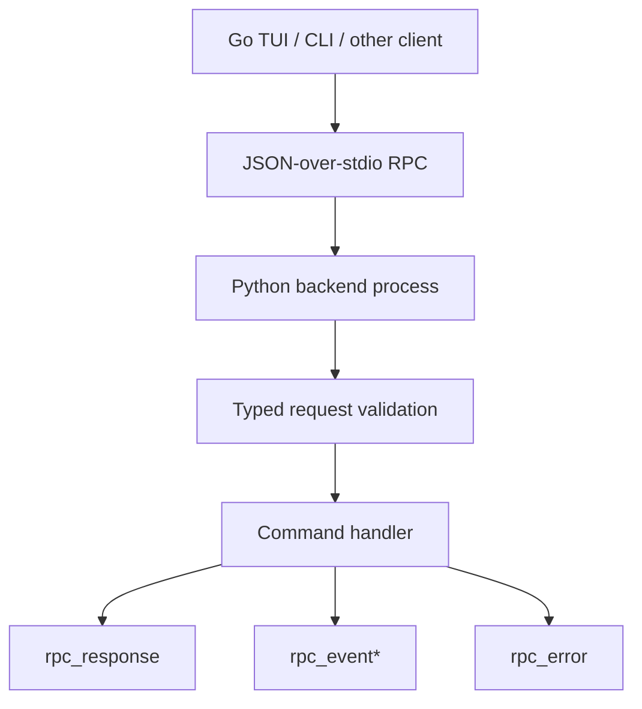
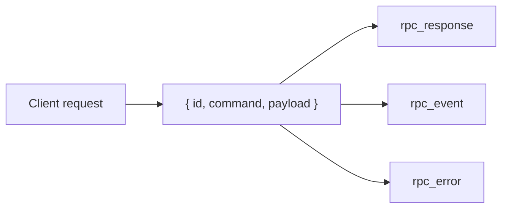
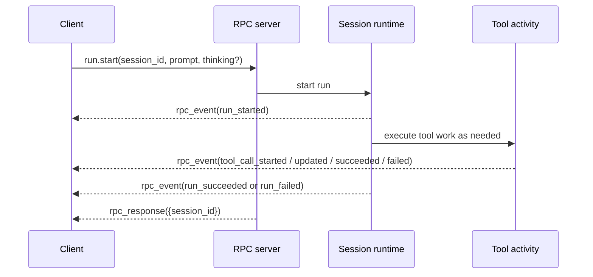
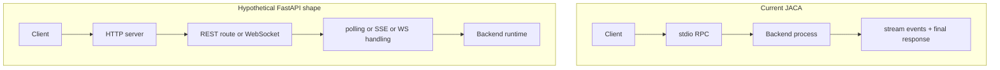
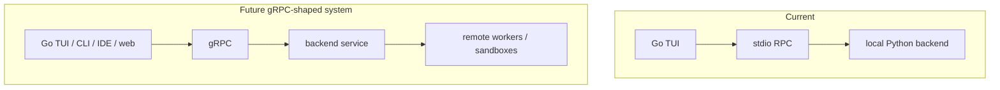

# API Design In JACA

read_when: you want to understand JACA's API design deeply, including why it uses typed JSON-over-stdio RPC, how the contract is structured, and why that is different from a FastAPI or REST-first architecture

## Purpose

This doc explains JACA's API design as a system-design choice, not a framework accident.

The core point is:

- JACA absolutely has an API
- it is just not an HTTP API

The API is:

- typed request and response models
- typed streamed event models
- JSON-over-stdio transport
- a long-lived local backend process

Read this with:

- [../mental-model.md](../mental-model.md)
- [../contracts.md](../contracts.md)
- [../adr/0003-canonical-session-and-rpc-contract.md](../adr/0003-canonical-session-and-rpc-contract.md)
- [05-identity-api-and-observability.md](05-identity-api-and-observability.md)

Main code anchors:

- [../../src/just_another_coding_agent/contracts/rpc.py](../../src/just_another_coding_agent/contracts/rpc.py)
- [../../src/just_another_coding_agent/contracts/run_events.py](../../src/just_another_coding_agent/contracts/run_events.py)
- [../../src/just_another_coding_agent/rpc/stdio.py](../../src/just_another_coding_agent/rpc/stdio.py)

## The Main API Choice

JACA chose:

- JSON-over-stdio
- explicit command names
- explicit request payloads
- explicit streamed events
- one final response per command

instead of:

- REST over HTTP
- route-per-resource design
- polling as the default interaction pattern

That choice is deliberate and rooted in the product shape.

## Visual: Current API Shape

The asterisk matters:

- a command may emit zero or more `rpc_event`s
- then exactly one final `rpc_response`

That is the core lifecycle pattern.

## Visual: Envelope Design

The protocol really has three top-level output envelopes:

This is cleaner than mixing:

- HTTP success codes
- SSE side channels
- unrelated polling endpoints

for a local long-lived runtime.

## Visual: `run.start`

This is the most important API flow in the system.

That is not REST-shaped.

It is lifecycle-shaped.

## What The API Actually Exposes

You can see the request models in:

- [../../src/just_another_coding_agent/contracts/rpc.py](../../src/just_another_coding_agent/contracts/rpc.py)

Some of the most important commands are:

- `auth.status`
- `auth.set`
- `auth.clear`
- `workspace.trust_status`
- `workspace.trust_accept`
- `session.create`
- `session.name`
- `session.preview`
- `session.compact`
- `run.start`
- `run.enqueue`
- `run.interrupt`
- `permission.get`
- `permission.set`
- `approval.submit`

This tells you something important:

JACA's API is not resource-first.

It is command-first.

## Why This Shape Fits JACA

## 1. The product is local-process-first

JACA is a local backend with a thin TUI on top.

That is explicit in:

- [../mental-model.md](../mental-model.md)
- [../adr/0003-canonical-session-and-rpc-contract.md](../adr/0003-canonical-session-and-rpc-contract.md)

For that shape, stdio gives you:

- no port management
- no daemon lifecycle to install and supervise
- no localhost network exposure by default
- no HTTP-specific client machinery

## 2. The system is lifecycle-oriented, not CRUD-oriented

JACA's important actions are things like:

- start a run
- enqueue follow-up work
- interrupt an active run
- stream canonical events
- compact a session

You can force those into REST, but they are not naturally REST concepts.

`run.start` is not really:

- “create a run row”

It is:

- “start and stream a live execution lifecycle”

## 3. Streaming is first-class

JACA wants:

- one request
- zero or more streamed events
- one final response

That is very natural for:

- stdio streams
- WebSockets
- gRPC streams

It is less natural for plain REST without adding extra streaming layers.

## 4. The contract is the product surface

JACA treats strict contracts as the real boundary.

That means API design here is mainly about:

- typed payloads
- typed events
- ordering rules
- ownership of meaning

not about picking a fashionable web framework.

## Why Not FastAPI?

There is no single repo doc that says:

- “we reject FastAPI for reason X”

So this section is an architectural inference from the codebase and docs, not a quoted decision record.

My read is:

FastAPI would be the wrong default for the current product shape because JACA is not primarily a network service. It is a local long-lived backend process designed to be driven by a first-party TUI and similar local clients.

If JACA used FastAPI today, it would introduce extra surface area:

- HTTP server lifecycle
- port allocation
- localhost exposure
- HTTP client plumbing in the TUI
- SSE or WebSocket work for live event streaming
- more operational complexity than the local product actually needs

So the accurate answer is not:

- “FastAPI is bad”

It is:

- “FastAPI solves a different deployment shape”

## Visual: JACA RPC Vs Hypothetical HTTP Design

The second shape may be correct for a hosted service.

It is not obviously better for JACA as it exists now.

## When FastAPI Would Make More Sense

If JACA became:

- a remote hosted control plane
- browser-first
- multi-tenant
- cross-machine
- service-to-service integrated

then HTTP or gRPC would become much more attractive.

In that world, I would still try to preserve the same core semantics:

- command-oriented actions
- streamed lifecycle events
- backend-owned typed contract

The transport might change.

The meaning should not.

## When JACA Would Become gRPC

I would not replace stdio RPC with gRPC while JACA is primarily:

- local TUI
- local Python backend
- same-machine child-process communication

I would seriously consider gRPC once the backend becomes a true service boundary.

That means conditions like:

- the Python backend runs as a separate long-lived service
- clients and backend may live on different machines or containers
- multiple typed clients in different languages need one shared RPC schema
- server streaming or bidirectional streaming becomes a core network requirement
- remote orchestration or remote sandbox workers become first-class architecture
- service-to-service auth, deadlines, metadata, and mTLS start to matter

### Visual: When The Boundary Changes

### Why gRPC Then

gRPC becomes attractive when JACA needs:

- typed cross-language service contracts
- network-native streaming
- internal platform RPC
- stronger service-level operational semantics

That is a very different deployment shape from today's local stdio pairing.

### What I Would Not Do

I would not switch to gRPC just because it is more "serious."

That would add:

- network-service lifecycle
- deployment complexity
- more moving parts

without solving a real current problem in the local product.

### Best Likely Evolution

The mature move is probably:

- keep stdio RPC for local embedded mode
- add gRPC for remote/service mode later
- preserve the same backend-owned command and event semantics underneath

## What JACA Already Gets Right About API Design

## 1. Typed requests

Requests are strict Pydantic models in:

- [../../src/just_another_coding_agent/contracts/rpc.py](../../src/just_another_coding_agent/contracts/rpc.py)

That means:

- no ad hoc payloads
- no silent extra fields
- no vague command shapes

## 2. Typed streamed events

Run and session lifecycle events are explicit contract models in:

- [../../src/just_another_coding_agent/contracts/run_events.py](../../src/just_another_coding_agent/contracts/run_events.py)

This is much better than “the client watches stdout and guesses.”

## 3. Opaque identifiers

Session IDs are opaque hex IDs, not exposed filesystem paths.

That is good API hygiene because clients do not couple to storage layout.

## 4. Clear ordering rules

The RPC contract in [../contracts.md](../contracts.md) is strong on ordering:

- what requests are valid
- when events may appear
- what ends a stream
- what is an `rpc_error` versus a failed run event

That is good API design discipline.

## 5. Backend-owned meaning

Clients are supposed to render backend meaning, not infer it locally.

That is especially important for:

- queue state
- approval flow
- auth readiness
- lifecycle events

This is one of the strongest API instincts in the repo.

## Where The Current API Is Limited

JACA's API is strong for the current local product shape.

Its likely limitations are:

- stdio transport is tightly local-process-oriented
- it is not a ready-made public web service API
- external integrator ergonomics are not the first design target
- some commands reflect current product workflows more than a broader platform abstraction

These are not bugs.

They are scope choices.

## How To Study API Design In This Repo

Read these in order:

1. [../adr/0003-canonical-session-and-rpc-contract.md](../adr/0003-canonical-session-and-rpc-contract.md)
2. [../mental-model.md](../mental-model.md)
3. [../contracts.md](../contracts.md)
4. [../../src/just_another_coding_agent/contracts/rpc.py](../../src/just_another_coding_agent/contracts/rpc.py)
5. [../../src/just_another_coding_agent/rpc/stdio.py](../../src/just_another_coding_agent/rpc/stdio.py)

Then answer:

1. What is the transport?
2. What are the top-level envelopes?
3. What is the request shape?
4. What events stream during long-running operations?
5. What is a protocol error versus a runtime failure?
6. What semantics are backend-owned rather than client-inferred?

## Interview Explanation

Good answer:

> JACA uses a typed command-oriented RPC API over JSON-over-stdio because the product is a local long-lived backend with streaming lifecycle semantics, not a hosted CRUD service. The important design choice is not “no FastAPI”; it is that the contract is explicit, streamed, backend-owned, and transport-stable for the product shape it currently serves.

## What To Remember

The deep lesson is:

API design is not mainly about whether you chose REST, FastAPI, or gRPC.

It is about:

- what the boundary is
- what semantics cross it
- whether state transitions are explicit
- whether clients can stay simple and correct

JACA is actually pretty strong on those questions.
