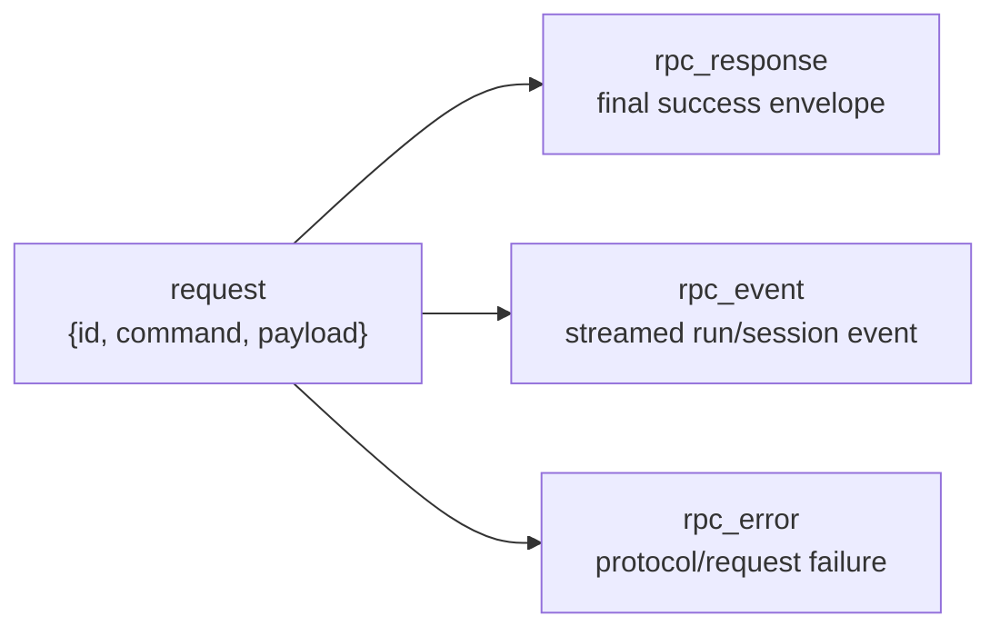
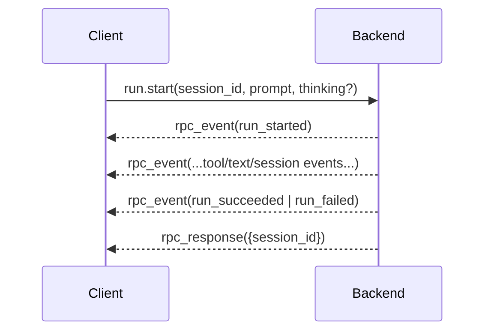

# API Design In JACA

read_when: you want a contract-level explanation of JACA's API shape, every current RPC command family, the streamed run semantics, and why the system chose typed stdio RPC instead of an HTTP-first API

## Core Point

JACA does have a serious API. It is just not an HTTP API.

The API is:

- a closed, typed RPC contract
- line-delimited JSON over stdio
- command-oriented, not resource-oriented
- event-streaming for live runs
- backend-owned in meaning and state transitions

The main sources are:

- [../adr/0003-canonical-session-and-rpc-contract.md](../adr/0003-canonical-session-and-rpc-contract.md)
- [../mental-model.md](../mental-model.md)
- [../contracts.md](../contracts.md)
- [../../src/just_another_coding_agent/contracts/rpc.py](../../src/just_another_coding_agent/contracts/rpc.py)
- [../../src/just_another_coding_agent/rpc/stdio.py](../../src/just_another_coding_agent/rpc/stdio.py)

## What The API Actually Looks Like

One request is one JSON line:

```json
{"id":"req-2","command":"run.start","payload":{"session_id":"a1b2c3d4e5f67890a1b2c3d4e5f67890","prompt":"fix the bug","thinking":"high"}}
```

The backend emits one or more JSON lines back. Every line is exactly one of:

- `rpc_response`
- `rpc_event`
- `rpc_error`

### Visual: Envelope Model



ASCII fallback:

```text
request line
  -> rpc_response
  -> rpc_event
  -> rpc_error
```

## The Contract Is Intentionally Strict

The models in [contracts/rpc.py](../../src/just_another_coding_agent/contracts/rpc.py) use a shared `_RpcModel` with:

- `extra="forbid"`
- `frozen=True`

That means:

- unknown fields are rejected
- payloads are explicit
- request shape is closed over known commands

`RpcRequest` is a discriminated union on `command`. In practice, the API is:

- one request id
- one command string
- one typed payload model
- one typed response model or typed event stream or typed protocol error

This is much tighter than "send some JSON and hope both sides agree."

## The Four Envelope Types

### 1. Request

Defined by the `RpcRequest` union in [contracts/rpc.py](../../src/just_another_coding_agent/contracts/rpc.py:217).

Shared fields:

- `id`: client correlation id
- `command`: discriminator
- `payload`: typed command-specific body

### 2. `rpc_response`

Defined by `RpcResponseEnvelope` in [contracts/rpc.py](../../src/just_another_coding_agent/contracts/rpc.py:345).

Meaning:

- final success envelope for a request

Important:

- a successful `run.start` still ends with exactly one `rpc_response`
- the streamed run events come before that final response

### 3. `rpc_event`

Defined by `RpcEventEnvelope` in [contracts/rpc.py](../../src/just_another_coding_agent/contracts/rpc.py:376).

Meaning:

- streamed runtime event

Payload is:

- `RunEvent`
- or `SessionLifecycleEvent`

This is how JACA avoids polling.

### 4. `rpc_error`

Defined by `RpcErrorEnvelope` in [contracts/rpc.py](../../src/just_another_coding_agent/contracts/rpc.py:382).

Meaning:

- protocol-level or request-level failure

Examples from [docs/contracts.md](../contracts.md):

- `InvalidJSON`
- `InvalidRequest`
- `UnknownSession`
- `InvalidSession`
- `InternalError`

Important distinction:

- `rpc_error` means the request could not be processed as a valid RPC operation
- `run_failed` means a valid run started and then failed as part of normal run semantics

That distinction keeps protocol failure separate from domain failure.

## Handler Dispatch And Concurrency

`handle_rpc_json_line(...)` in [rpc/stdio.py](../../src/just_another_coding_agent/rpc/stdio.py) does three things:

1. parse JSON
2. validate against the discriminated `RpcRequest` union
3. dispatch to the matching handler from `_RPC_HANDLERS`

Current handler map includes:

- `session.create`
- `model.catalog`
- `auth.status`
- `auth.prepare_file`
- `auth.set`
- `auth.clear`
- `auth.login_openai_codex.start`
- `auth.login_openai_codex.wait`
- `auth.login_openai_codex.complete`
- `trace.logfire_status`
- `run.start`
- `run.enqueue`
- `run.interrupt`
- `permission.get`
- `permission.set`
- `approval.submit`
- `session.name`
- `session.preview`
- `workspace.project_docs`
- `workspace.trust_status`
- `workspace.trust_accept`
- `session.compact`

`serve_rpc_stdio(...)` also serializes requests per `session_id` inside one backend process by using a per-session async lock. That is an API-relevant behavior:

- same-session commands are not allowed to race each other locally
- different sessions can still proceed independently

## Command Families

The best way to understand JACA's API is by command family.

## 1. Catalog And Auth Commands

These commands answer "what providers/models are available?" and "is the backend authenticated and ready?"

| Command | Payload | Response | Streams? | Important rule |
| --- | --- | --- | --- | --- |
| `model.catalog` | `{}` | provider list, default model ids, model descriptions | no | shipped model catalog is backend-owned metadata |
| `auth.status` | `{}` | provider readiness, local secret store status, OAuth provider status | no | readiness is computed by backend, not inferred by client |
| `trace.logfire_status` | `{}` | `installed`, `credentials_configured` | no | observability readiness is explicit backend state |
| `auth.prepare_file` | `{"provider": <provider>}` | file path + snippets for configuring file auth | no | helper for explicit local secret-file flow |
| `auth.set` | `{"provider": <provider>, "secret": <string>, "storage": "file"}` | updated provider auth status | no | stores without echoing the secret back |
| `auth.clear` | `{"provider": <provider>}` | updated provider auth status | no | removes explicit local secret-file entry |
| `auth.login_openai_codex.start` | `{}` | `flow_id`, `auth_url`, `instructions` | no | creates backend-owned OAuth login flow state |
| `auth.login_openai_codex.wait` | `{"flow_id": <string>}` | OAuth provider status | no | waits for the backend-owned callback flow |
| `auth.login_openai_codex.complete` | `{"flow_id": <string>, "callback_or_code": <string>}` | OAuth provider status | no | manual completion/fallback path |

### Example: `auth.status`

Request:

```json
{"id":"req-0","command":"auth.status","payload":{}}
```

Response:

```json
{"type":"rpc_response","id":"req-0","response":{"providers":[{"provider":"openai","configured":false,"secret_configured":false,"requires_secret":true,"source":"none","env_key":"OPENAI_API_KEY","reason":"missing_secret"}],"local_secret_store":{"available":true,"message":null,"file_store_path":"/home/user/.jaca/auth.json"},"oauth_providers":[]}}
```

Why this matters:

- provider readiness is backend-authored
- the client does not guess from environment variables
- secret storage and OAuth status are folded into one canonical answer

## 2. Workspace Trust And Project-Docs Commands

These commands own the repo trust gate and project-instruction disclosure.

| Command | Payload | Response | Streams? | Important rule |
| --- | --- | --- | --- | --- |
| `workspace.trust_status` | `{}` | `trusted`, `trust_target` | no | trust is stored per repo-root target |
| `workspace.trust_accept` | `{}` | `trusted`, `trust_target` | no | accepting trust unblocks repo-doc loading and session bootstrap |
| `workspace.project_docs` | `{}` | list of project docs | no | fails hard with `WorkspaceUntrusted` until trust is accepted |

Important separation:

- workspace trust is a startup gate
- it is not the same thing as sandbox permissions
- trusting the repo does not itself grant reads, writes, network, or shell escalation

## 3. Session Commands

These commands own durable session identity and presentation helpers over stored state.

| Command | Payload | Response | Streams? | Important rule |
| --- | --- | --- | --- | --- |
| `session.create` | `{}` | `session_id`, maybe project docs | no | fails hard until workspace trust is accepted |
| `session.name` | `{"session_id": <id>, "name": <string>}` | normalized name | no | name is backend-normalized and unique within workspace |
| `session.preview` | `{"session_id": <id>}` | bounded preview entries + `truncated` | no | presentation helper only; does not change resume authority |
| `session.compact` | `{"session_id": <id>}` | `compaction_id`, `compacted_through_run_id` | no | fails hard if summary generation fails |

Two design details matter here:

- session ids are opaque lowercase 32-hex strings, not paths
- JACA has no `session.continue`; `run.start` on an existing session is the canonical continue operation

### Example: `session.create`

Request:

```json
{"id":"req-1","command":"session.create","payload":{}}
```

Response:

```json
{"type":"rpc_response","id":"req-1","response":{"session_id":"a1b2c3d4e5f67890a1b2c3d4e5f67890","project_docs":[]}}
```

## 4. Run-Control Commands

This is the center of the API.

| Command | Payload | Response | Streams? | Important rule |
| --- | --- | --- | --- | --- |
| `run.start` | `{"session_id": <id>, "prompt": <string>, "thinking": <optional-thinking-setting>}` | `session_id` | yes | zero or more `rpc_event`, then exactly one final `rpc_response` |
| `run.enqueue` | `{"session_id": <id>, "prompt": <string>, "mode": "next" \| "later"}` | `session_id`, `queued_count` | no | accepted only while an active streamed run exists in this backend process |
| `run.interrupt` | `{"session_id": <id>, "promote_queued_steer": <bool>}` | `session_id`, `promoted_count` | no | accepted only while an active streamed run exists in this backend process |

This is why JACA is not well-described as CRUD.

`run.start` is not "create a row." It is:

- resume/continue a session-backed conversation
- stream canonical run events
- possibly drain queued follow-up runs on the same stream
- end with a final response only after those drains complete

`run.enqueue` is not "update run." It is:

- attach steering or follow-up text to an already-live run in memory

`run.interrupt` is not "delete run." It is:

- cancel the active run and optionally promote queued steering into immediate follow-up delivery

### Visual: `run.start`



ASCII fallback:

```text
run.start
  -> run_started
  -> zero or more run/session events
  -> run_succeeded or run_failed
  -> final rpc_response
```

### Important run semantics from the contract

- `run.start` on an existing session is the canonical continue operation
- `run.enqueue` with `mode: "later"` is the canonical follow-up queueing path
- `run.enqueue` with `mode: "next"` is the canonical active-turn steer path
- if pending `next` prompts survive to end of run, they downgrade into `later`
- `run.interrupt` with `promote_queued_steer: true` promotes pending `next` prompts into immediate follow-up delivery
- queue order is backend-owned and explicit
- multiple prompts in a queue bucket are batch-combined in FIFO order with blank-line separation

### Example: `run.start`

Request:

```json
{"id":"req-2","command":"run.start","payload":{"session_id":"a1b2c3d4e5f67890a1b2c3d4e5f67890","prompt":"fix the bug","thinking":"high"}}
```

Stream:

```json
{"type":"rpc_event","id":"req-2","event":{"type":"run_started","run_id":"abc"}}
{"type":"rpc_event","id":"req-2","event":{"type":"run_succeeded","run_id":"abc"}}
{"type":"rpc_response","id":"req-2","response":{"session_id":"a1b2c3d4e5f67890a1b2c3d4e5f67890"}}
```

### Example: `run.enqueue`

Request:

```json
{"id":"req-3","command":"run.enqueue","payload":{"session_id":"a1b2c3d4e5f67890a1b2c3d4e5f67890","prompt":"after that, run the tests","mode":"later"}}
```

Response:

```json
{"type":"rpc_response","id":"req-3","response":{"session_id":"a1b2c3d4e5f67890a1b2c3d4e5f67890","queued_count":1}}
```

## 5. Permission And Approval Commands

These commands are the live control-plane surface.

| Command | Payload | Response | Streams? | Important rule |
| --- | --- | --- | --- | --- |
| `permission.get` | `{"session_id": <id>}` or `{"session_id": null}` | `permission_state` | no | without an active session id, operates on workspace default permission state |
| `permission.set` | `{"session_id": <optional-id>, "sandbox_policy": <optional>, "approval_policy": <optional>}` | updated `permission_state` | no | must set at least one explicit override |
| `approval.submit` | `{"session_id": <id>, "decision": <approval-decision>}` | echoed decision + session id | no | resolves a live pending approval request |

Critical distinction from [docs/contracts.md](../contracts.md):

- live `PermissionState` is control-plane state used by RPC and approval flows
- durable `effective_capabilities` written into session turn context is historical model-visible state

That means:

- `permission.get` / `permission.set` are about what is allowed right now
- stored transcript/session history is about what happened and what the model previously saw

### Example: `permission.set`

Request:

```json
{"id":"req-7","command":"permission.set","payload":{"session_id":null,"sandbox_policy":"read_only"}}
```

Response:

```json
{"type":"rpc_response","id":"req-7","response":{"session_id":null,"permission_state":{"sandbox_policy":"read_only","approval_policy":"on_escalation","effective_capabilities":{...}}}}
```

## What Actually Streams

Most commands are one-request/one-response.

The main streamed command is:

- `run.start`

Its stream can include:

- run events such as `run_started`, `run_succeeded`, `run_failed`
- tool lifecycle events
- session lifecycle events such as compaction-related events
- queue state events such as `session_queue_state`

Important client rule from [docs/contracts.md](../contracts.md):

- clients must render queue preview from `session_queue_state`
- they must not infer queue state from `run_started`, `run_failed`, or local enqueue bookkeeping

This is a very strong API-design choice:

- queue meaning belongs to backend state
- clients render the authoritative event instead of reconstructing it

## Protocol Errors Vs Domain Failures

This distinction is one of the most important things to understand.

### `rpc_error`

Use when the request itself is invalid or cannot be processed as RPC:

- bad JSON
- bad payload
- unknown session
- invalid persisted session state
- internal server failure before a valid run lifecycle is underway

### `run_failed`

Use when:

- `run.start` was a valid request
- the run started
- the run then failed as part of run semantics

That is why the contract says:

- a valid request that ends in run failure still emits `rpc_event` ending in `run_failed`
- it does not switch to `rpc_error`

This is excellent API hygiene. It keeps transport correctness and domain correctness separate.

## Stateful Preconditions Matter

The API is not stateless in the REST sense. Several commands depend on live in-memory backend state:

- `run.enqueue` is accepted only while that session has an active streamed run in this backend process
- `run.interrupt` is accepted only while that session has an active streamed run in this backend process
- `approval.submit` resolves a live pending approval
- `session.create` is blocked by workspace trust state
- `workspace.project_docs` is blocked by workspace trust state
- `permission.get` / `permission.set` can target workspace-default state when no session is supplied

That is another reason this contract is naturally RPC-shaped rather than route-shaped.

## Why This Is RPC And Not REST

You can wrap these commands in HTTP if you want, but their true semantics are still RPC semantics.

A few examples:

- `run.interrupt` with `promote_queued_steer: true` is an action with specific live-run behavior, not a natural resource update
- `approval.submit` resolves a pending approval state machine, not a generic row mutation
- `auth.login_openai_codex.start` / `wait` / `complete` is an explicit flow, not a stable resource CRUD model
- `run.enqueue` mutates an in-memory active-run queue whose meaning is defined by backend lifecycle rules

REST can expose these operations, but it would mostly be HTTP wrapping around an RPC model.

## Why Stdio Instead Of FastAPI Or Another HTTP Server

This section is an architectural inference from the repo, not a quoted design note.

For the current product shape, stdio fits better because JACA is:

- a local Python backend
- driven by a local Go TUI or CLI wrapper
- long-lived enough to stream events
- not yet a remote multi-tenant service

Stdio avoids:

- server lifecycle management
- local port allocation
- localhost auth/exposure questions
- SSE or WebSocket just to get streaming
- extra deployment machinery for a companion process

FastAPI would make more sense if JACA became:

- a hosted control plane
- a browser-facing product
- a multi-machine service
- an integration platform for many external clients

Right now the architecture is much closer to:

```text
client process -> child backend process -> streamed RPC over stdio
```

than to:

```text
many remote clients -> network service -> HTTP routes
```

## Under What Conditions gRPC Would Make Sense

gRPC becomes attractive when the boundary becomes a real service boundary instead of local companion-process IPC.

That usually means:

- backend runs as a separate service
- clients live on different machines or containers
- cross-language typed clients matter more
- bidirectional or server streaming must survive network hops cleanly
- service auth, deadlines, metadata, retries, and observability become important platform concerns

The mature architecture would likely be:

- keep stdio RPC for local embedded mode
- add gRPC for remote/service mode
- preserve the same command and event semantics underneath

## The Main API Design Lessons In JACA

JACA gets several things right:

- closed command set through a discriminated union
- strict request validation with no unknown fields
- opaque session identifiers instead of storage-shaped identifiers
- backend-owned semantics for trust, auth readiness, queue state, approval, and permission posture
- explicit separation between `rpc_error` and `run_failed`
- one canonical live-run command family: `run.start`, `run.enqueue`, `run.interrupt`
- streamed events instead of polling-based client reconstruction

The most important lesson is:

**API design here is not "which web framework did we pick?"**

It is:

- who owns meaning
- which state transitions are explicit
- what can be streamed
- what must not be inferred by clients
- which failures are protocol failures versus valid domain outcomes

That is why this API is more serious than "JSON over stdin/stdout" sounds at first glance.
