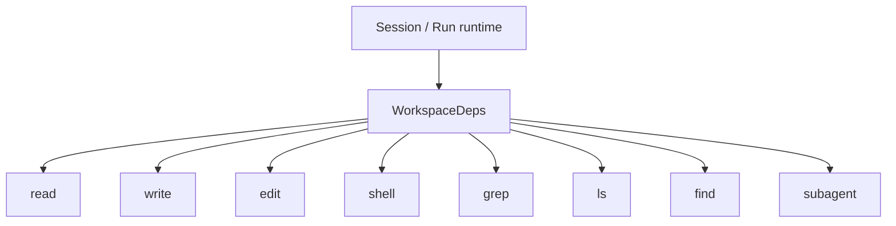
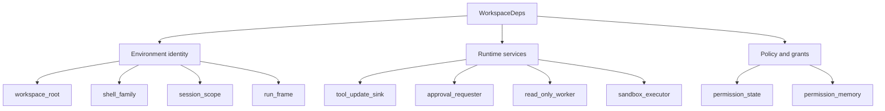
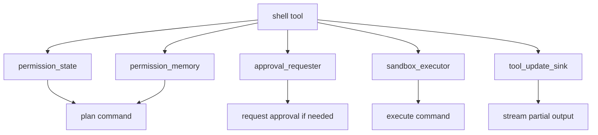

# WorkspaceDeps And Runtime Context

read_when: you want to understand what `WorkspaceDeps` is, why JACA injects it into every tool call, and how it connects policy, execution, state, and runtime services

## Purpose

This doc explains one of the most important runtime seams in JACA:

- `WorkspaceDeps`

If the control-plane models in `contracts/sandbox.py` tell you what the system means,
`WorkspaceDeps` tells you what each tool call knows about the current run.

## One-Line Definition

`WorkspaceDeps` is JACA's per-run dependency bundle for tool execution.

It carries:

- workspace identity
- session and run lineage
- runtime metadata
- policy state
- remembered grants
- execution helpers
- runtime callbacks

Definition:

- [../../src/just_another_coding_agent/tools/deps.py](../../src/just_another_coding_agent/tools/deps.py:188)

## Why This Object Exists

Without `WorkspaceDeps`, every tool would need random access to:

- workspace root
- shell family
- permission state
- approval callback
- tool progress callback
- read-only worker
- shell executor
- session lineage

That would create:

- globals
- ad hoc function parameters
- duplicated runtime wiring
- hidden dependencies

Instead, JACA makes the run context explicit and injects it into every tool as:

- `RunContext[WorkspaceDeps]`

You can see that pattern across the tool layer:

- [../../src/just_another_coding_agent/tools/read.py](../../src/just_another_coding_agent/tools/read.py:96)
- [../../src/just_another_coding_agent/tools/write.py](../../src/just_another_coding_agent/tools/write.py:41)
- [../../src/just_another_coding_agent/tools/edit.py](../../src/just_another_coding_agent/tools/edit.py:201)
- [../../src/just_another_coding_agent/tools/shell.py](../../src/just_another_coding_agent/tools/shell.py:384)

## Visual: Where `WorkspaceDeps` Sits

The point is:

- tools get one consistent runtime context
- tools do not each invent their own side channels

## The Best Mental Model

Think of `WorkspaceDeps` as:

> everything a tool needs to know about the current run, except the tool's own user/model arguments

If the tool argument is:

- `path`
- `command`
- `pattern`

then `WorkspaceDeps` is the surrounding execution context.

## The Supporting Types In `tools/deps.py`

Before `WorkspaceDeps` itself, there are four important helper types in the same file.

## 1. `ToolUpdateSink`

Definition:

- [../../src/just_another_coding_agent/tools/deps.py](../../src/just_another_coding_agent/tools/deps.py:36)

This is the callback type for incremental tool updates.

Used for things like:

- partial shell output
- subagent preview updates

This is how tools can stream progress back into the run event layer without knowing who the client is.

## 2. `ApprovalRequester`

Definition:

- [../../src/just_another_coding_agent/tools/deps.py](../../src/just_another_coding_agent/tools/deps.py:40)

This is the callback type a tool uses when it needs approval.

This is important because the tool does not directly talk to the UI.

It asks the backend runtime:

- here is the `ApprovalRequest`
- resolve it for me

That keeps approval as a backend-owned control-plane operation.

## 3. `SessionPermissionMemory`

Definition:

- [../../src/just_another_coding_agent/tools/deps.py](../../src/just_another_coding_agent/tools/deps.py:59)

This stores remembered session-scoped grants such as:

- approved extra read roots
- approved extra write roots
- approved command prefixes

This is a very important object because it turns approvals into durable operational state rather than transient UI moments.

## 4. `RunSessionScope`

Definition:

- [../../src/just_another_coding_agent/tools/deps.py](../../src/just_another_coding_agent/tools/deps.py:141)

This tells the tool which run/session lineage it belongs to.

It can describe:

- root runs
- subagent runs
- parent/child relationships

That matters for:

- transcript attribution
- subagent lineage
- runtime observability

## 5. `RunRuntimeFrame`

Definition:

- [../../src/just_another_coding_agent/tools/deps.py](../../src/just_another_coding_agent/tools/deps.py:180)

This holds runtime metadata such as:

- model
- current date
- timezone
- thinking setting

This is the lightweight per-run frame around the tool call environment.

## `WorkspaceDeps` Field Map

Now the main object.

Definition:

- [../../src/just_another_coding_agent/tools/deps.py](../../src/just_another_coding_agent/tools/deps.py:188)

## Visual: Field Groups

## Environment Identity Fields

### `workspace_root`

- where the run is rooted
- the main filesystem anchor for tool behavior

Why it matters:

- relative tool paths need a canonical base
- workspace scoping is part of the product boundary

### `shell_family`

- `posix` or `powershell`

Why it matters:

- command execution semantics differ
- quoting and invocation behavior differ

### `session_scope`

- root vs subagent
- session id
- run id
- optional parent lineage

Why it matters:

- this is run identity for tools
- subagents need explicit lineage, not implicit guessing

### `run_frame`

- model
- current date
- timezone
- thinking

Why it matters:

- tools and runtime framing may depend on current run context
- this keeps that context explicit

## Runtime Service Fields

### `tool_update_sink`

This is how a tool sends partial progress updates without coupling to the client.

Example:

- shell output updates in [../../src/just_another_coding_agent/tools/shell.py](../../src/just_another_coding_agent/tools/shell.py:149)

### `approval_requester`

This is how tools ask for approval.

The tool does not:

- prompt the user itself
- decide UI behavior

It sends a structured request into the runtime.

Example:

- shell escalation in [../../src/just_another_coding_agent/tools/shell.py](../../src/just_another_coding_agent/tools/shell.py:177)

### `read_only_worker`

This is the persistent helper for read-only file/search operations.

Definition:

- [../../src/just_another_coding_agent/tools/read_only_worker/runtime.py](../../src/just_another_coding_agent/tools/read_only_worker/runtime.py:1)

Why it matters:

- keeps read-only work on a narrower runtime path
- avoids forcing shell to own every filesystem read/search operation

### `sandbox_executor`

This is the shell execution backend.

Definition:

- [../../src/just_another_coding_agent/tools/sandbox_executor.py](../../src/just_another_coding_agent/tools/sandbox_executor.py:1)

Today it defaults to:

- `HostSandboxExecutor`

Architecturally, this is the future seam for:

- gVisor
- Firecracker
- other stronger backends

## Policy And Grant Fields

### `permission_state`

This is the current effective permission posture for the run.

It includes:

- sandbox policy
- approval policy
- effective capabilities

Definition:

- [../../src/just_another_coding_agent/contracts/sandbox.py](../../src/just_another_coding_agent/contracts/sandbox.py:136)

### `permission_memory`

This is remembered session-scoped permission state.

It is different from `permission_state`.

The distinction is:

- `permission_state` = current normalized policy posture
- `permission_memory` = remembered grants from prior approvals in the session

That distinction matters a lot.

## How `WorkspaceDeps` Gets Built

## Session-backed runs

The main place it is created is:

- [../../src/just_another_coding_agent/runtime/session.py](../../src/just_another_coding_agent/runtime/session.py:384)

That creation includes:

- workspace root
- shell family
- session scope
- runtime frame
- permission state
- permission memory

At this stage it is the base run context.

## Run binding

Then the runtime binds run-specific callbacks in:

- [../../src/just_another_coding_agent/runtime/run.py](../../src/just_another_coding_agent/runtime/run.py:225)

That adds:

- `run_id`
- `tool_update_sink`
- `approval_requester`

So the pattern is:

1. build base deps for the run
2. attach run-specific live callbacks
3. inject into tool execution

That is a good pattern.

## Subagents

Subagents get a derived `WorkspaceDeps` in:

- [../../src/just_another_coding_agent/runtime/subagent.py](../../src/just_another_coding_agent/runtime/subagent.py:208)

That keeps:

- workspace root
- shell family

but changes:

- session lineage

That is exactly what you want.

## Concrete Example: Shell Tool

The shell tool is the best place to see `WorkspaceDeps` doing real work.

See:

- [../../src/just_another_coding_agent/tools/shell.py](../../src/just_another_coding_agent/tools/shell.py:154)

`execute_shell(...)` uses `ctx.deps` to get:

- `sandbox_executor`
- `permission_state`
- `permission_memory`
- `approval_requester`
- `tool_update_sink`

That means shell logic stays focused on shell behavior because the runtime context is already bundled.

## Visual: Shell Tool Dependency Use

## What `WorkspaceDeps` Is Not

It is not:

- a session persistence object
- a general configuration file
- the full state plane
- the public RPC API
- a random bag of globals

It is specifically:

- the per-run tool execution context

That distinction is important.

## Why This Is Good Design

`WorkspaceDeps` is good design because it keeps these concerns explicit:

- run identity
- workspace boundary
- policy state
- remembered grants
- approval plumbing
- execution backend
- partial tool updates

That is much better than:

- hidden globals
- tool-local re-resolution
- each tool inventing its own dependencies

## What It Still Does Not Solve

`WorkspaceDeps` does not automatically make the system:

- strongly sandboxed
- remotely orchestrated
- multi-tenant
- fully declarative

It is a strong local runtime seam, not the whole platform.

That is the honest way to think about it.

## Interview One-Liner

> `WorkspaceDeps` is JACA's explicit per-run dependency bundle for tool execution. It gives every tool the same runtime context: workspace identity, run lineage, permission state, remembered grants, approval callbacks, execution backends, and progress sinks, without forcing each tool to discover those concerns independently.

## Best Way To Study This

Read in this order:

1. [../../src/just_another_coding_agent/tools/deps.py](../../src/just_another_coding_agent/tools/deps.py:1)
2. [../../src/just_another_coding_agent/runtime/session.py](../../src/just_another_coding_agent/runtime/session.py:384)
3. [../../src/just_another_coding_agent/runtime/run.py](../../src/just_another_coding_agent/runtime/run.py:225)
4. [../../src/just_another_coding_agent/tools/shell.py](../../src/just_another_coding_agent/tools/shell.py:154)
5. [../../src/just_another_coding_agent/runtime/subagent.py](../../src/just_another_coding_agent/runtime/subagent.py:208)

Then try explaining:

- why `WorkspaceDeps` exists
- why `permission_state` and `permission_memory` are different
- why `approval_requester` is a callback instead of a UI concern
- why `sandbox_executor` belongs here
