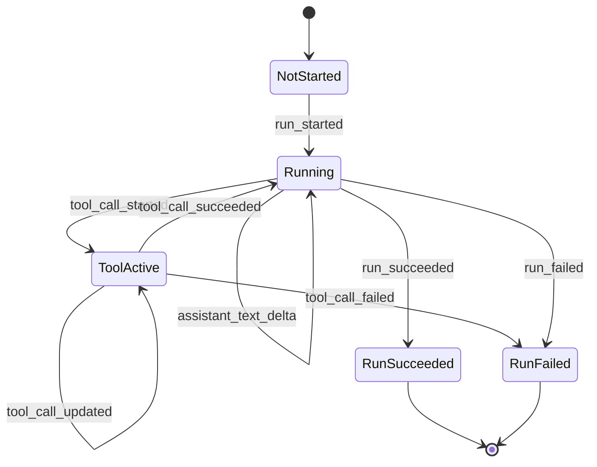
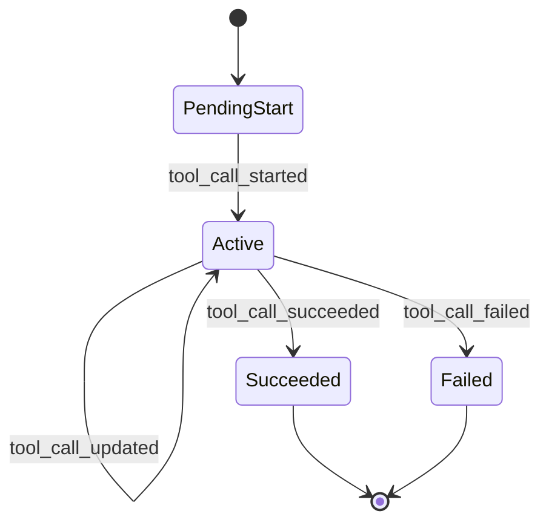
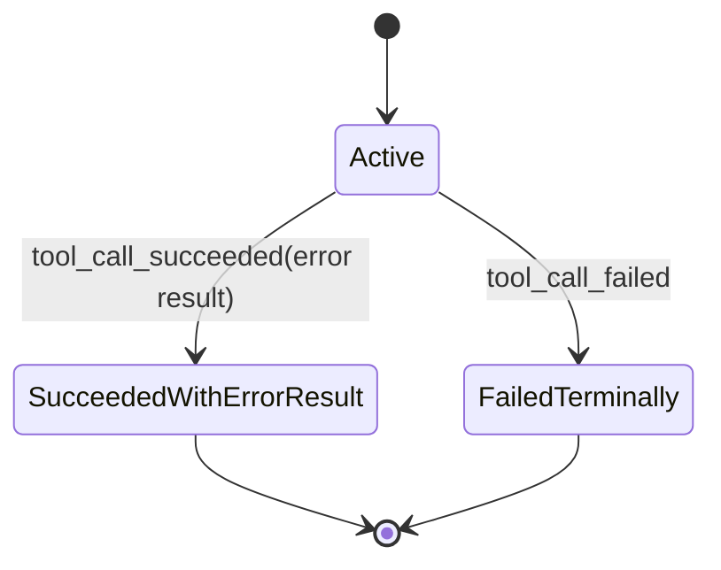
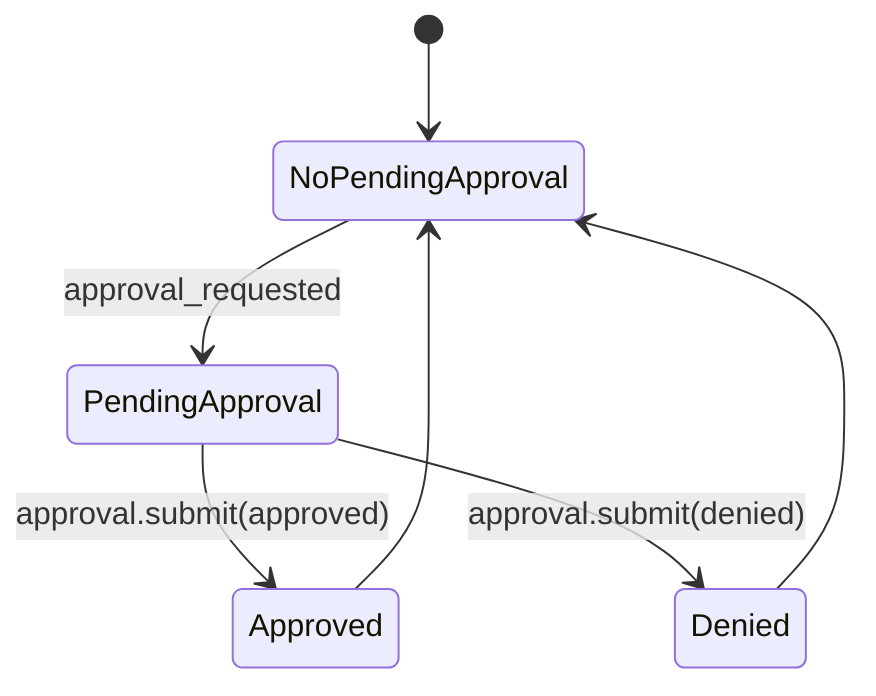
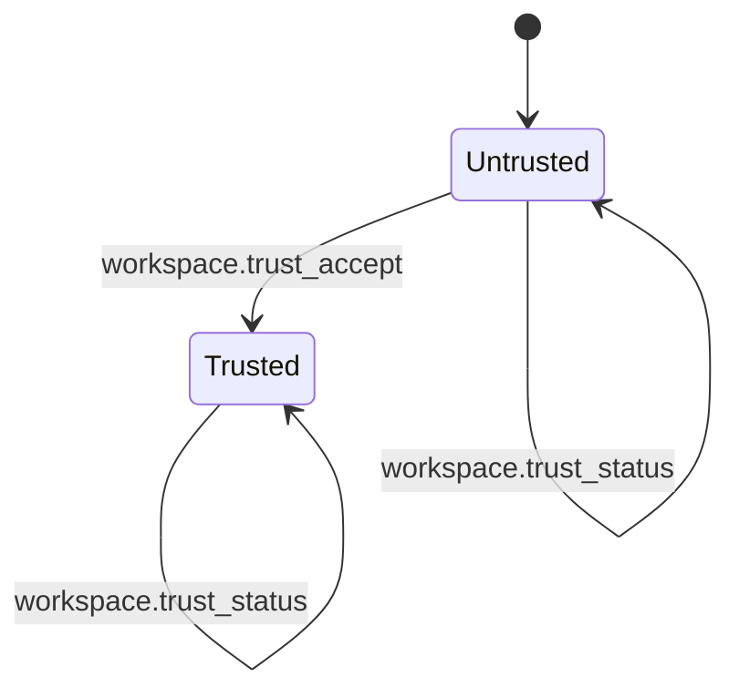
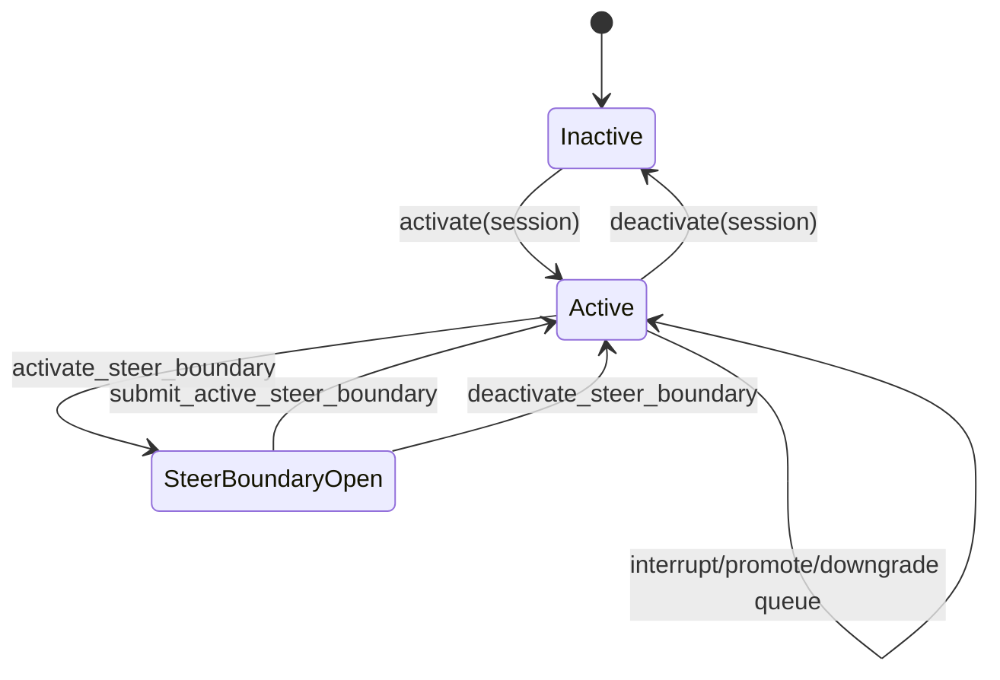
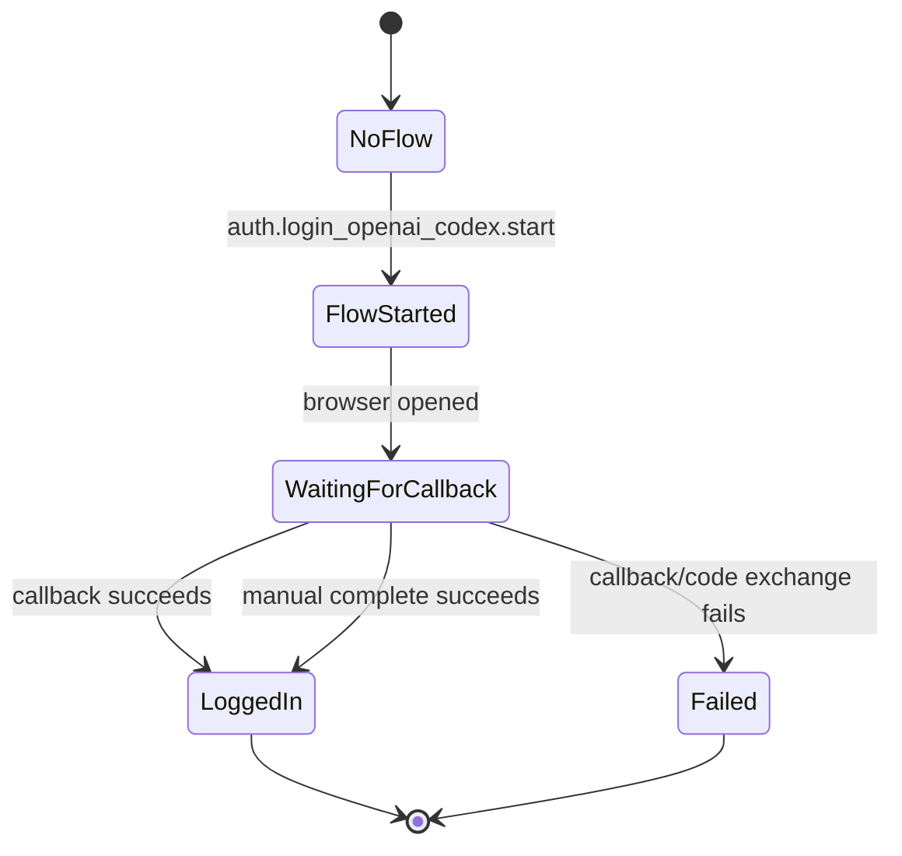

# Automata Theory And State Machines In JACA

read_when: you want to learn automata and state-machine concepts through real JACA subsystems instead of abstract textbook examples

## Purpose

This is not a general automata textbook.

It is a JACA-grounded guide to the state-machine ideas that actually show up in the repo.

The goal is to help you see JACA as:

- a family of interacting state machines
- with explicit transitions
- explicit invalid states
- explicit terminal states
- and strong validation of legal traces

## Big Idea

JACA is full of finite-state thinking.

Examples:

- a run has a lifecycle
- a tool call has a lifecycle
- workspace trust has a gate
- approval requests move from pending to resolved
- OAuth login has a start/wait/complete flow
- active-run queue state changes over time
- persisted run traces are validated against legal event ordering

If you understand automata theory at a practical level, you will read these parts of JACA much more cleanly.

## What Kind Of "Automata" JACA Mostly Uses

Most JACA stateful pieces are best thought of as:

- deterministic finite-state controllers
- plus explicit external memory

That is important.

JACA is usually **not** a pure textbook DFA in the strict smallest sense, because it often has extra stored data like:

- run ids
- pending tool call ids
- queued prompts
- permission memory
- persisted session files

So the honest description is:

- finite control state
- with explicit data structures around it

That is closer to practical systems design than to a tiny classroom automaton.

## Concept Map

| Automata concept | JACA example | Anchor |
|---|---|---|
| state | `run_started`, `run_succeeded`, `trusted`, pending approval | [run_events.py](../../src/just_another_coding_agent/contracts/run_events.py), [workspace_trust.py](../../src/just_another_coding_agent/runtime/workspace_trust.py) |
| input symbol | RPC command, approval submit, callback, tool result | [contracts/rpc.py](../../src/just_another_coding_agent/contracts/rpc.py) |
| transition | `run.start`, `run.interrupt`, `approval.submit`, `workspace.trust_accept` | [rpc/stdio.py](../../src/just_another_coding_agent/rpc/stdio.py) |
| start state | before `run_started`, untrusted workspace, no active login flow | [contracts.md](../contracts.md), [workspace_trust.py](../../src/just_another_coding_agent/runtime/workspace_trust.py) |
| terminal state | `run_succeeded`, `run_failed`, logged-in OAuth status | [run_events.py](../../src/just_another_coding_agent/contracts/run_events.py), [auth.py](../../src/just_another_coding_agent/auth.py) |
| invalid transition | event after terminal, tool result before tool start, unknown approval request | [session/jsonl.py](../../src/just_another_coding_agent/session/jsonl.py), [rpc/stdio.py](../../src/just_another_coding_agent/rpc/stdio.py) |
| accepted language | valid persisted run-event trace | [session/jsonl.py](../../src/just_another_coding_agent/session/jsonl.py) |
| guarded transition | interrupt requires active run, approval submit requires pending request | [rpc/stdio.py](../../src/just_another_coding_agent/rpc/stdio.py) |
| hierarchical machine | run contains tool sub-lifecycles | [docs/mental-model.md](../mental-model.md) |
| machine with external memory | queue state, permission memory, session JSONL | [rpc/stdio.py](../../src/just_another_coding_agent/rpc/stdio.py), [tools/deps.py](../../src/just_another_coding_agent/tools/deps.py) |

## 1. Run Lifecycle As A State Machine

This is the cleanest state machine in JACA.

The core event types are:

- `run_started`
- `assistant_text_delta`
- `tool_call_started`
- `tool_call_updated`
- `tool_call_succeeded`
- `tool_call_failed`
- `run_succeeded`
- `run_failed`

See:

- [../../src/just_another_coding_agent/contracts/run_events.py](../../src/just_another_coding_agent/contracts/run_events.py:160)
- [../mental-model.md](../mental-model.md)

### Visual



### Concepts Here

- **start state**: before `run_started`
- **terminal states**: `run_succeeded`, `run_failed`
- **determinism**: once terminal is reached, nothing else may happen
- **hierarchy**: tool activity is a sub-lifecycle nested inside the run

### Grounded Invariant

JACA validates this explicitly:

- no events after terminal
- a run must start with `run_started`
- terminal success and terminal failure are mutually exclusive

See:

- [../../src/just_another_coding_agent/session/jsonl.py](../../src/just_another_coding_agent/session/jsonl.py:765)

## 2. Tool Call Lifecycle As A Submachine

Each tool call has its own smaller state machine.

### Visual



### Concepts Here

- **submachine**: tool lifecycle is nested inside run lifecycle
- **uniqueness constraint**: tool ids must be unique while pending
- **guard**: update or result requires a matching started tool call

This is enforced in:

- [../../src/just_another_coding_agent/session/jsonl.py](../../src/just_another_coding_agent/session/jsonl.py:797)

This is a good example of a trace validator acting like a recognizer for legal event strings.

### Important Nuance: Not Every Tool Problem Is `tool_call_failed`

This is one of the most important runtime distinctions in JACA.

There are really two categories:

1. expected tool-domain problem
   - represented as `tool_call_succeeded` with an explicit error-shaped result
   - the model can usually continue in the same run

2. uncaught tool or runtime failure
   - represented as `tool_call_failed`
   - the current run should then end with `run_failed`

Contract anchor:

- [../contracts.md](../contracts.md:763)

### Visual



The important interpretation is:

- `tool_call_succeeded` can still mean “the tool hit a normal operational problem”
- `tool_call_failed` means “the runtime could not safely continue this run”

That is why `tool_call_failed` is terminal in JACA.

## 3. Approval As A Small Request-Response Machine

Approval is not just “show prompt.”

It is a real state transition in the backend.

At the contract level you can see:

- `ApprovalRequestedEvent`
- `ApprovalResolvedEvent`
- `approval.submit`

See:

- [../../src/just_another_coding_agent/contracts/run_events.py](../../src/just_another_coding_agent/contracts/run_events.py:169)
- [../../src/just_another_coding_agent/contracts/rpc.py](../../src/just_another_coding_agent/contracts/rpc.py:240)

### Visual



### Concepts Here

- **guarded transition**: `approval.submit` only works if the request is actually pending
- **invalid transition**: unknown or already-resolved approval request is rejected
- **state normalization**: backend normalizes lean decisions before using them

Grounded handler:

- [../../src/just_another_coding_agent/rpc/stdio.py](../../src/just_another_coding_agent/rpc/stdio.py:947)

## 4. Workspace Trust As A Two-State Gate

Workspace trust is one of the simplest machines in the repo.

It is also a good example of a startup gate separate from sandbox policy.

See:

- [../../src/just_another_coding_agent/runtime/workspace_trust.py](../../src/just_another_coding_agent/runtime/workspace_trust.py:24)
- [../workspace-trust.md](../workspace-trust.md)

### Visual



### Concepts Here

- **binary state machine**
- **gate condition**: `session.create` is blocked while untrusted
- **state query vs state-changing transition**

This is a nice example of:

- `trust_status` = observation
- `trust_accept` = transition

## 5. Queue State As Finite Control Plus External Memory

The active-run queue is a great example of where pure finite automaton language is helpful, but not sufficient by itself.

Why:

- there is finite control state such as “active run” and “steer boundary active”
- but there are also deques storing arbitrary queued prompts

See:

- [../../src/just_another_coding_agent/rpc/stdio.py](../../src/just_another_coding_agent/rpc/stdio.py:143)
- [../../src/just_another_coding_agent/contracts/run_events.py](../../src/just_another_coding_agent/contracts/run_events.py:267)

### Simplified Visual



### Concepts Here

- **finite control state**: active vs inactive, steer boundary open vs closed
- **external memory**: next queue and later queue contents
- **observable state**: backend emits `session_queue_state`

This is exactly the kind of system where “finite-state controller + explicit memory” is the right mental model.

## 6. OAuth Login As A State Machine

The OAuth flow is another concrete state machine in JACA.

See:

- [07-oauth-authentication-flow.md](07-oauth-authentication-flow.md)
- [../../src/just_another_coding_agent/oauth_openai_codex.py](../../src/just_another_coding_agent/oauth_openai_codex.py)
- [../../src/just_another_coding_agent/rpc/stdio.py](../../src/just_another_coding_agent/rpc/stdio.py:709)

### Visual



### Concepts Here

- **tokenized flow state**: `flow_id`, verifier, state
- **guarded callback**: returned `state` must match
- **two completion paths to one canonical result**

This is a practical state machine, not just protocol prose.

## 7. Persisted Run Validation As A Language Recognizer

This is the most automata-theory-flavored example in the repo.

The persisted run validator in:

- [../../src/just_another_coding_agent/session/jsonl.py](../../src/just_another_coding_agent/session/jsonl.py:765)

is acting like a recognizer for the language:

- “all legal run-event traces”

That means:

- some event sequences are accepted
- some are rejected

### Examples

Accepted shape:

```text
run_started
tool_call_started
tool_call_succeeded
run_succeeded
```

Rejected shape:

```text
tool_call_succeeded
run_started
run_succeeded
```

Rejected because:

- tool result appeared before tool start

Rejected shape:

```text
run_started
run_succeeded
assistant_text_delta
```

Rejected because:

- an event appeared after terminal state

### Concepts Here

- **language of valid traces**
- **recognizer / validator**
- **rejection on invalid ordering**
- **safety property enforcement**

This is one of the cleanest ways automata theory directly helps you read JACA.

## 8. Determinism In JACA

JACA strongly prefers deterministic state transitions.

Examples:

- a run has exactly one terminal event
- tool result must match the corresponding tool start
- trust target resolution is explicit
- approval resolution is keyed by request id

This matters because deterministic systems are:

- easier to validate
- easier to persist
- easier to reason about after failure

## 9. Guards And Invalid Transitions

One of the most useful automata ideas for reading JACA is:

- not every input is valid in every state

Examples:

- `run.interrupt` requires an active run
- `approval.submit` requires a pending request
- `workspace.trust_accept` changes trust only for the resolved trust target
- a tool update requires a pending started tool call

JACA usually handles invalid transitions by:

- rejecting them explicitly
- failing hard
- emitting `rpc_error` or raising format errors

That is good formal-systems hygiene.

## 10. Safety Vs Liveness

This is a useful pair of concepts that really exists in JACA.

### Safety

“Something bad never happens.”

Examples:

- no events after terminal outcome
- no orphan tool results
- no run without `run_started`
- no unknown approval request can be resolved

### Liveness

“Something good eventually happens.”

Examples:

- `run.start` should eventually end in `run_succeeded` or `run_failed`
- interruption should eventually drive the run to terminal failure
- queue draining should eventually submit follow-up batches

JACA is stronger on safety than on abstract liveness proofs, which is normal for a product codebase.

## 11. Hierarchical And Composite Machines

JACA is not one state machine.

It is a composition of machines:

- session machine
  - contains runs
- run machine
  - contains tool-call submachines
- approval machine
  - interacts with the run machine
- queue machine
  - interacts with the active run
- trust machine
  - gates session creation
- OAuth machine
  - affects auth readiness

That is a practical example of hierarchical and interacting state machines.

## What JACA Is Not, In Automata Terms

JACA is not best described as:

- a pure DFA with no memory
- a parser generator problem
- a pushdown automaton problem in the public contract
- a Turing machine exercise

It is best described as:

- deterministic stateful backend logic
- with explicit finite control states
- plus structured external memory and persistence

That is the right level for learning from this codebase.

## Why This Matters For You

If you start seeing JACA this way, several things become easier:

- contracts look like legal alphabets and outputs
- validators look like recognizers
- runtime bugs look like invalid transitions
- persistence bugs look like illegal trace acceptance
- API design looks like state transition design

That is exactly the kind of systems instinct that helps in design interviews.

## Interview One-Liner

> JACA is full of small deterministic state machines: run lifecycle, tool lifecycle, approval resolution, workspace trust, OAuth login, and active-run queue state. The interesting engineering move is that these machines are explicit, validated, and often persisted, which makes the system easier to reason about and safer to evolve.
